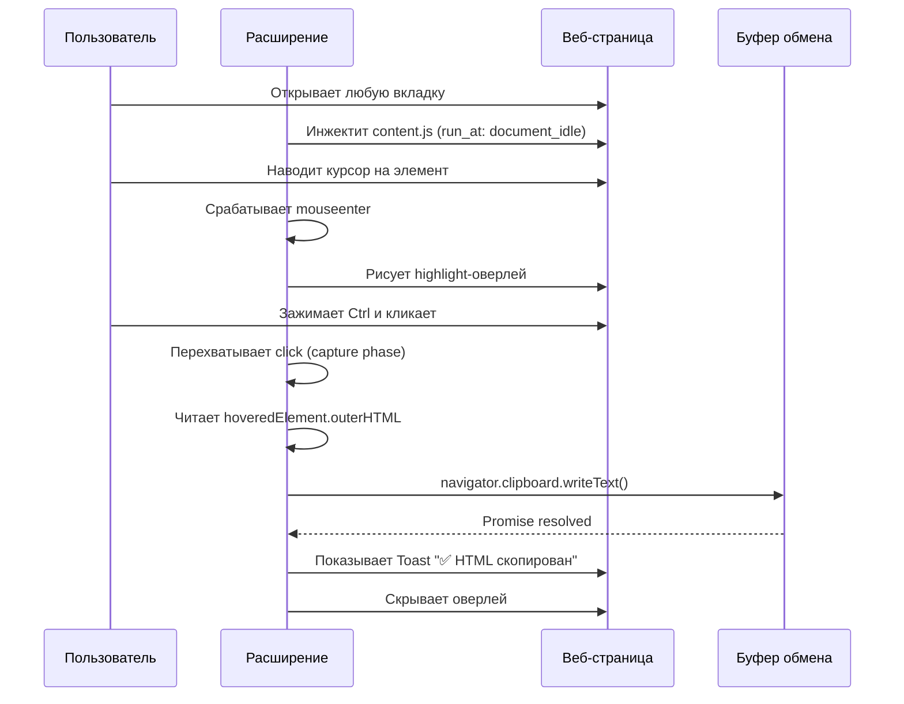

# 📘 Спецификация расширения браузера: `HTML Copy on Hover`

## 1. Обзор
Расширение для браузеров на базе Chromium (Chrome, Edge, Opera, Brave) и Firefox, предназначенное для быстрого копирования HTML-разметки элементов веб-страниц. Работает без открытия DevTools, используя интуитивный механизм наведения и клика.

**Ключевая ценность:**  
Сокращение времени на извлечение DOM-элементов для разработчиков, QA-инженеров, дизайнеров и технических специалистов.

---

## 2. Цели и задачи
| № | Цель | Метрика успеха |
|---|------|----------------|
| 1 | Визуальная идентификация элемента при наведении | Подсветка появляется ≤ 50 мс, не перекрывает интерактив |
| 2 | Копирование HTML в буфер обмена по одному действию | Успешный `navigator.clipboard.writeText()` ≥ 99% раз |
| 3 | Минимальное влияние на производительность страницы | CPU ≤ 2%, Memory ≤ 5 MB, 0 layout thrashing |
| 4 | Совместимость с современными веб-стандартами | Manifest V3, работа в Chrome 110+, Firefox 115+, Edge 110+ |

---

## 3. Архитектура и стек технологий
| Компонент | Описание |
|-----------|----------|
| **Manifest V3** | Современный стандарт расширений, поддержка MV3 в Chrome/Edge/Firefox |
| **Content Script** | Единственный исполняемый модуль. Инжектится в каждую вкладку |
| **Язык** | Vanilla JavaScript (ES2020+), без зависимостей |
| **UI** | Динамический DOM-оверлей + Toast-уведомление, рендерятся контент-скриптом |
| **Хранение состояния** | Не требуется. Расширение stateless |
| **Фоновые процессы** | Отсутствуют. Все операции выполняются в контексте страницы |

---

## 4. Функциональные требования
### 4.1. Основные функции
- [x] Визуальная подсветка элемента при наведении курсора
- [x] Копирование `outerHTML` выбранного элемента в буфер обмена
- [x] Визуальная обратная связь (Toast: успех/ошибка)
- [x] Защита интерактива страницы (`pointer-events: none`)
- [x] Автоматическая работа на всех страницах без ручной активации

### 4.2. Параметры копирования (по умолчанию)
| Параметр | Значение | Описание |
|----------|----------|----------|
| Триггер | `Ctrl + Click` | Исключает случайные срабатывания на ссылках/кнопках |
| Формат | `outerHTML` | Включает сам тег и всё содержимое |
| Обрезка | `.trim()` | Удаляет ведущие/завершающие пробелы и переносы |
| Контекст | Активный элемент под курсором | Определяется через `mouseenter`/`mouseleave` |

---

## 5. Пользовательский сценарий (User Flow)


---

## 6. Технические детали реализации
### 6.1. Жизненный цикл скрипта
| Фаза | Действие |
|------|----------|
| `document_idle` | Создание оверлея, привязка слушателей |
| `mouseenter` | Определение `e.target`, обновление геометрии оверлея |
| `mouseleave` | Скрытие оверлея, сброс `hoveredElement` |
| `click (capture)` | Валидация `CtrlKey`, копирование, очистка UI |

### 6.2. Ключевые API
| API | Назначение | Примечание |
|-----|------------|------------|
| `Element.getBoundingClientRect()` | Получение координат относительно viewport | Учитывает скролл, трансформы |
| `navigator.clipboard.writeText()` | Запись в буфер | Требует HTTPS и пользовательского жеста |
| `EventTarget.addEventListener(..., { capture: true })` | Ранний перехват клика | Позволяет предотвратить стандартное поведение |
| `CSS `pointer-events: none` | Отключение взаимодействия с оверлеем | Гарантирует сквозной клик к странице |

### 6.3. Производительность
- **Оптимизация геометрии:** Обновление `top/left/width/height` только при смене элемента
- **Без reflow:** Оверлей использует `position: fixed`, не влияет на layout страницы
- **Event delegation:** Один слушатель на `document`, нет привязки к каждому узлу DOM

---

## 7. Безопасность и конфиденциальность
| Аспект | Статус | Пояснение |
|--------|--------|-----------|
| Сбор данных | ❌ Отсутствует | Нет телеметрии, аналитики, сетевых запросов |
| Разрешения | `activeTab` | Требуется только для инжекта в активную вкладку |
| Clipboard API | 🔒 Ограничен | Работает только по жесту пользователя, только HTTPS/localhost |
| Изоляция контекста | ✅ Content Script | Не имеет прямого доступа к `localStorage`/`cookies` страницы |
| XSS-риски | ✅ Минимальны | HTML копируется как строка, не исполняется |

---

## 8. Ограничения и граничные случаи
| Сценарий | Поведение | Обходной путь / Примечание |
|----------|-----------|----------------------------|
| `iframe` (cross-origin) | Наведение не срабатывает | Content Script не инжектится в cross-origin фреймы по умолчанию |
| Shadow DOM | Подсветка работает, копируется корень компонента | Для доступа к внутренностям требуется `e.composedPath()[0]` |
| Виртуализированные списки | Подсветка может мерцать при скролле | Геометрия обновляется синхронно с `mouseenter` |
| Отключённый Clipboard API | Ошибка записи, показывается Toast | Работает только в HTTPS или `localhost` |
| Динамическая замена DOM | Слушатели остаются валидными | Используется делегирование, новые узлы обрабатываются автоматически |

---

## 9. Тестирование и валидация
### 9.1. Матрица совместимости
| Браузер | Версия | Статус |
|---------|--------|--------|
| Chrome | 110+ | ✅ Полная поддержка |
| Edge | 110+ | ✅ Полная поддержка |
| Firefox | 115+ | ✅ Работает (нужен флаг `manifest_version: 3`) |
| Safari | 16.4+ | ⚠️ Частично (требует WebExtensions polyfill) |

### 9.2. Чек-лист тестирования
- [ ] Подсветка появляется на `div`, `span`, `button`, `img`, `svg`
- [ ] `Ctrl+Click` не ломает ссылки, формы, drag-and-drop
- [ ] Копирование работает на `https://` и `http://localhost`
- [ ] Toast исчезает через 2 секунды, не блокирует UI
- [ ] Оверлей не мешает скроллу, выделению текста, hover-эффектам сайта
- [ ] Расширение корректно загружается в режиме инкогнито (при разрешении)

---

## 10. Дорожная карта (Roadmap)
| Версия | Функция | Статус |
|--------|---------|--------|
| `v1.0` | Базовое копирование `outerHTML` по `Ctrl+Click` | ✅ Готово |
| `v1.1` | Popup-настройки: выбор `outerHTML` / `innerHTML` / `attributes` | 🟡 В планах |
| `v1.2` | Горячие клавиши (`Alt+C`), отключение для доменов | 🟡 В планах |
| `v1.3` | Поддержка Shadow DOM, кастомные форматы (JSON, Markdown) | 🔜 Исследование |
| `v2.0` | Режим "выделение области", экспорт в файл, интеграция с DevTools | 📅 Q3 2025 |

---

## 11. Структура проекта
```
html-copy-hover/
├── manifest.json      # Метаданные, разрешения, контент-скрипты
├── content.js         # Логика наведения, подсветки, копирования
└── assets/
    └── icon-128.png   # Иконка для панели расширений (опционально)
```

### `manifest.json` (ключевые поля)
```json
{
  "manifest_version": 3,
  "name": "HTML Copy on Hover",
  "version": "1.0",
  "permissions": ["activeTab"],
  "content_scripts": [{
    "matches": ["<all_urls>"],
    "js": ["content.js"],
    "run_at": "document_idle"
  }]
}
```

---

## 12. Рекомендации по развёртыванию
1. **Локальная разработка:**  
   `chrome://extensions` → Режим разработчика → Загрузить распакованное
2. **Публикация:**  
   Упаковка в `.zip` → Chrome Web Store Dashboard → Заполнение metadata → Публикация
3. **Обновления:**  
   Увеличение `version` в `manifest.json` → Новая загрузка → Браузер обновит автоматически

---

## 📎 Приложение: Глоссарий
| Термин | Определение |
|--------|-------------|
| `outerHTML` | Полная строка элемента, включая открывающий/закрывающий теги и содержимое |
| `pointer-events: none` | CSS-свойство, делающее элемент прозрачным для событий мыши |
| `capture phase` | Фаза всплытия/погружения событий, позволяющая перехватить событие до target-элемента |
| `run_at: document_idle` | Момент инжекта скрипта после полной загрузки DOM и стилей |

---

> ✅ **Статус документа:** Утверждено для реализации `v1.0`  
> 📅 **Дата создания:** 2024-06-15  
> 🔗 **Репозиторий:** *(указать при наличии)*  
> 📩 **Контакт техлида:** *(указать при наличии)*

---
💾 *Сохраните файл как `SPECIFICATION.md` в корне проекта. Документ готов для передачи команде, ревью или публикации в wiki.*